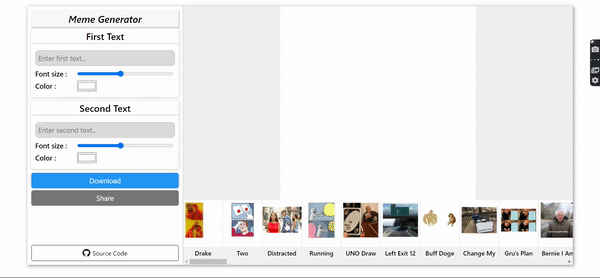

A simple Meme generator using [React](https://reactjs.org)

# Demo
Live demo [here](https://meme.namantam1.tech).

# Features
- Download meme
- Share meme
- Move text
- Resize text
- Colour text

# Library and API used

- [API sauce](https://github.com/infinitered/apisauce#readme): An HTTP client library
- [Styles Component](https://styled-components.com/)
- [react-lazy-load-image-component](https://github.com/Aljullu/react-lazy-load-image-component#readme) : To lazy load images in slider
- [Image flip meme API](https://imgflip.com/api): For fetching raw meme images
- [Tempfiler API](https://github.com/namantam1/tempfiler): To upload generated meme to get share link

> **NOTE :** On download only meme is not uploaded to server. Only for sharing meme is upload which is also delete from server after sometime.

# Working

Image and texts is drawn on a SVG and then SVG is exported as `image/png` by chaining it to `blob` object using canvas.

On share image is uploaded to server and image link is shared using Web share API.

## Known Issues
- Color picker lag on changing frequently. Throttling can be used to fixed this issue. 

# References
- [Drag’n’Drop algorithm](https://javascript.info/mouse-drag-and-drop)
- [Drawing DOM objects into a canvas
](https://web.archive.org/web/20181006205840/https://developer.mozilla.org/en-US/docs/Web/API/Canvas_API/Drawing_DOM_objects_into_a_canvas)
